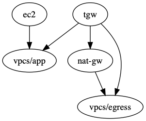

# sample egress vpc for transit gateway

## Motivation
Cost of nat gateways in multiple accounts, multiple vpcs and multiple zones vs
cost to attach multiple vpcs to a transit gateway favor aggregation of nat
gateways in a single "egress" vpc to serve as a common egress to the internet.
NOTE: this is not about aggregation application traffic or access, this is more
about providing access for supporting services like patching.

## prereq

install terragrunt and tfenv

```
brew install terragrunt tfenv
```

install terraform and set version

```
tfenv install 0.12.29
tfenv use 0.12.29
```

## gitrdone

This will build a sample transit gateway with an egress vpc hosting public nat
gateways and and a "app" vpc to host an ec2 for testing via ssm.

```
#get credentials in account you want to deploy this solution to
terragrunt apply-all -auto-approve
#you'll have to type "y" to proceed
```

connect to ec2 in private app vpc with ssm:

```
aws ssm start-session --target $instance_id
```

HINT: You can get this by:

```
cd ec2 && terraform output
```

try out bound connectivity:

```
# check your private ip
ifconfig
# ping google dns server
ping 8.8.8.8
# install a package
sudo yum install -y telnet
# your public ip should be the ip of the correlated egress vpc nat gw 
curl ifconfig.be
```

Ever feel cheated?

## Graph of terragrunt generated resources



```
terragrunt  graph-dependencies | dot -Tpng > images/egress.png
```

## Hygeine
```
# Clean up after your self
terragrunt apply-all -auto-approve
```
